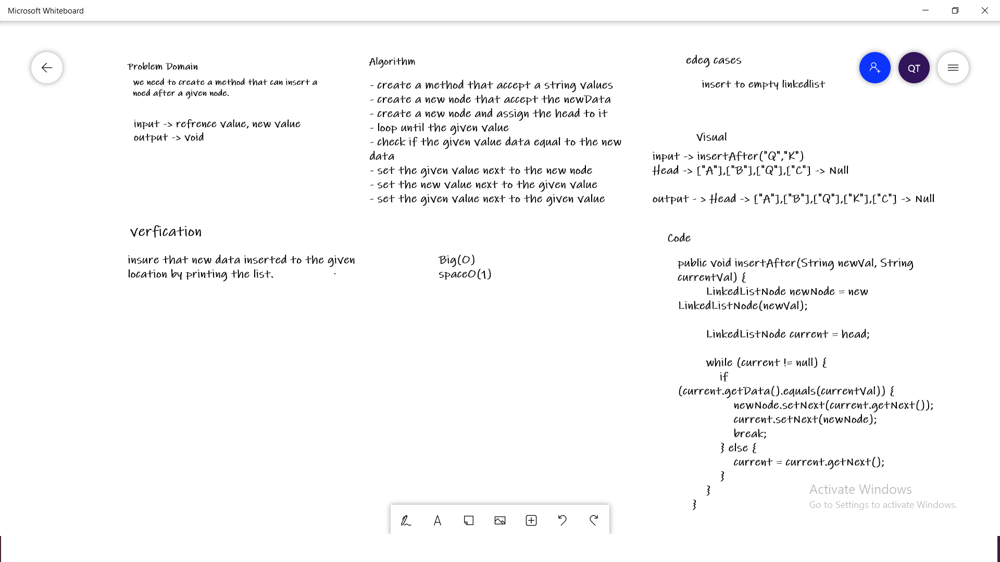
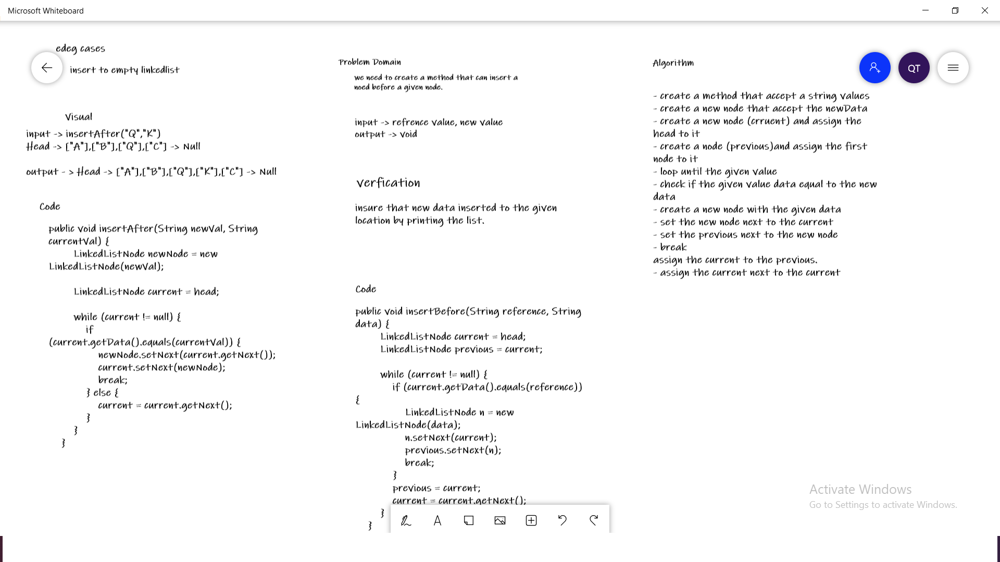
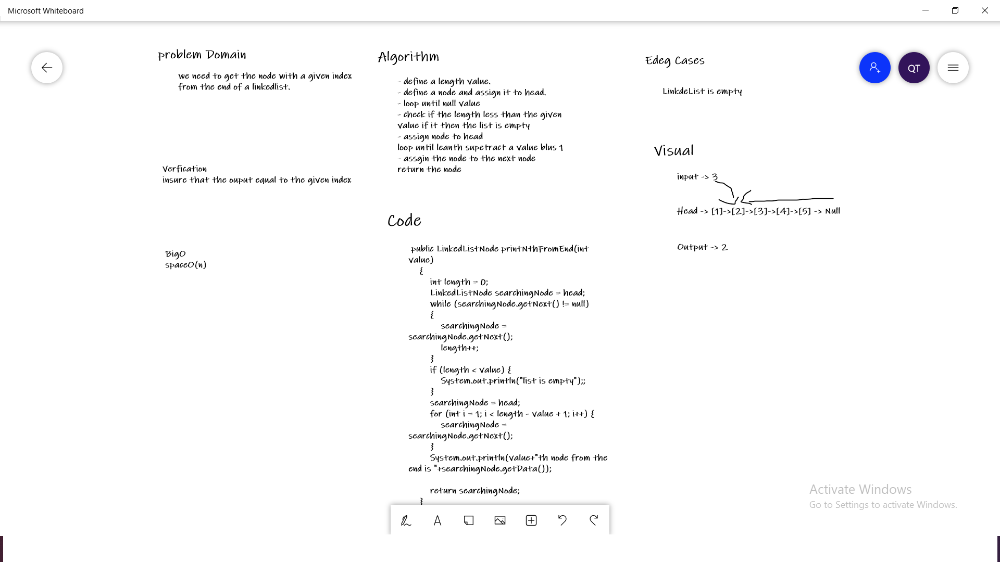
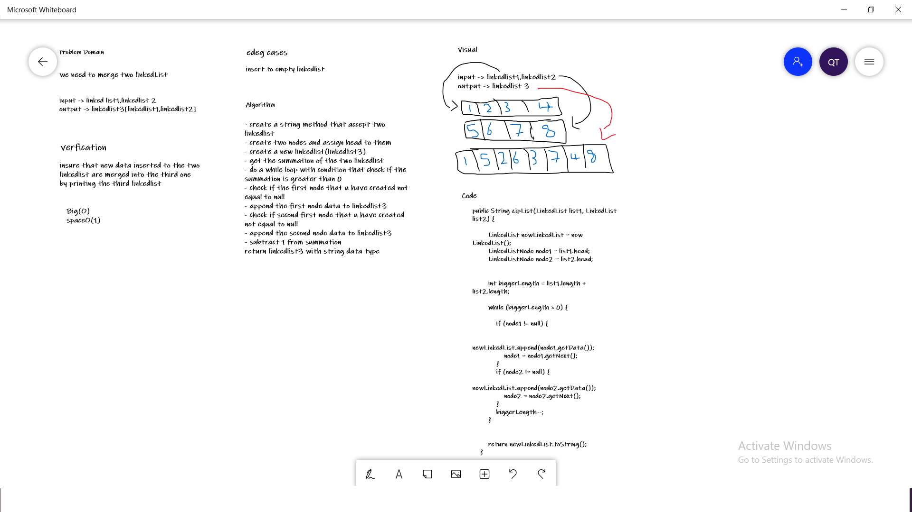

# Singly Linked List
**a chain of node that connected to each other by referencing
each of them to each other by adress, each one of them can hold
a value**

## Challenge
**the challenge was split into three parts**

- How to insert a node to the linkedlist.
- How to find e specific node within the linkedllist.
- How to print all of the linkedlist.

## Approach & Efficiency
**for each i took the the approach that most efficient**

- for insert method i took tha approach that have a bigO(n) for time
- for includes method i took tha approach that have a bigO(n) for time
- for print method i took tha approach that have a bigO(n) for time

## insert After WhiteBoard

## insert Before WhiteBoard

## Kth WhiteBoard

## ZipList WhiteBoard

