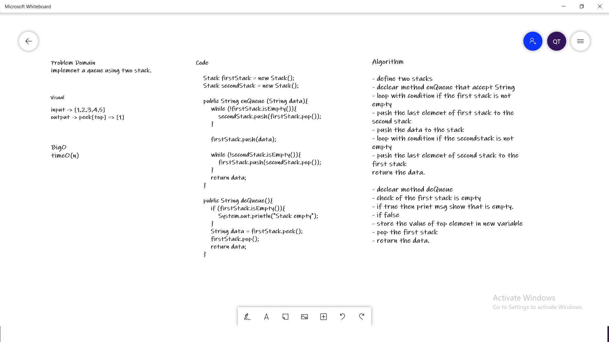
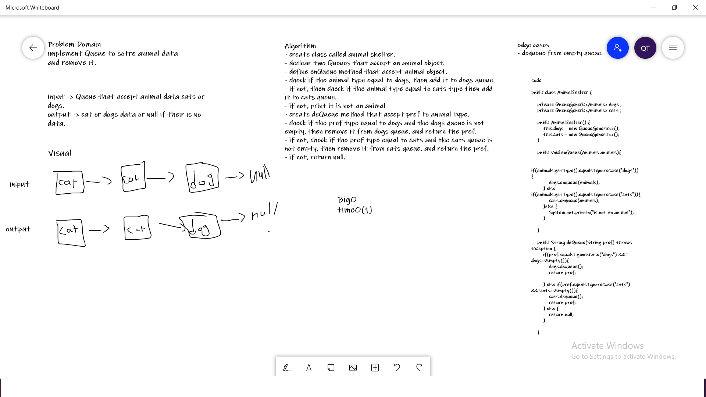
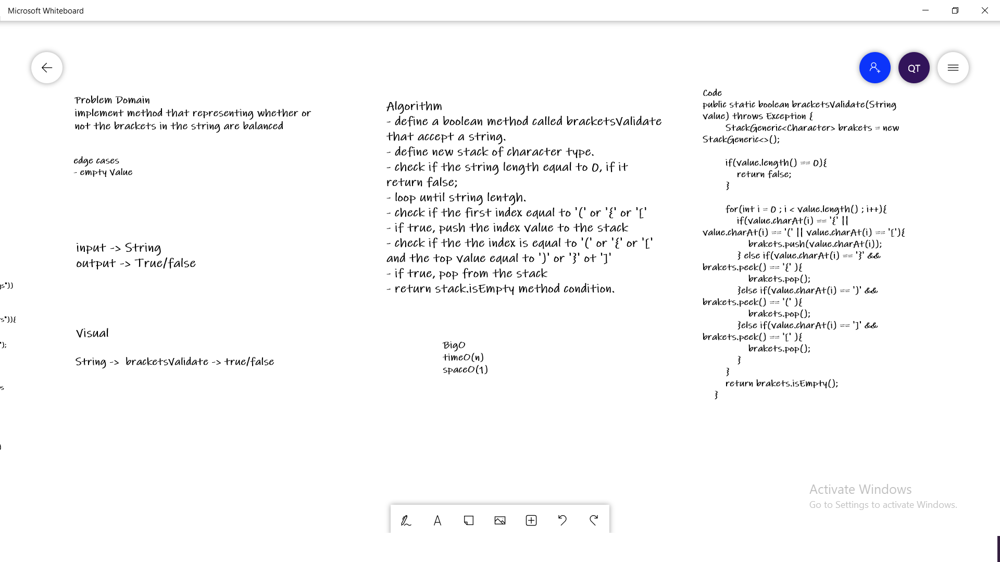

# Stacks and Queues
**Stack and Queue ara a special case of linkedlist
they consider as a space of memory, the Stack based
on FILO principle and Queue based on FIFO principle.**

## Challenge
**The challenge is to implement Stack and Queue from scratch
with all of their basic methods.**

**Stack :** 
- push : add to the Stack.
- pop : remove from the Stack.
- peek : get the Top element of the Stack.
- isEmpty : check if the Stack empty or not.

**Queue :**
- Enqueue : add to the Queue.
- Dequeue : remove from the Queue.
- peek : get the Top element of the Queue.
- isEmpty : check if the Queue empty or not.
## Approach & Efficiency

**i have used the most efficient approach that give me BigO(1)
fot all of Stack and Queue methods.**

## WhiteBoards

**Psedu**

## Animals

## Brackets

