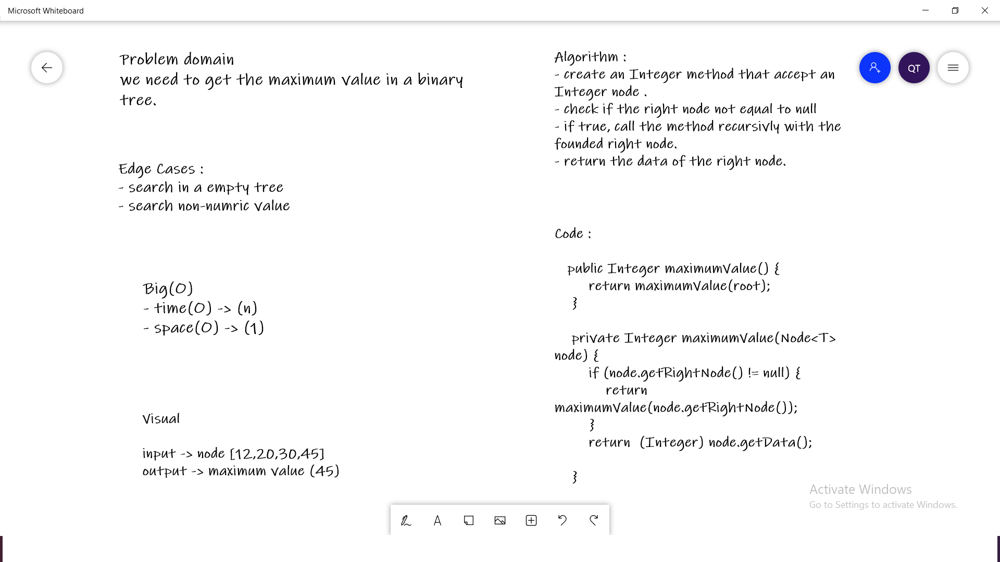

## Get Maximum Number
- Get the Maximum Value from tree.

## Challenge
- Create a maximumValue method that return a Maximum value of tree .

## Approach & Efficiency
- **For each method I took the approach that was most efficient:
MaximumValue : Big O space of 1 (constant) and time of O(n) (linear).**

## API
- MaximumValue return you a Maximum value in tree.

## WhiteBoard
**Get Maximum Number**

**BreadthFirst traversal**
